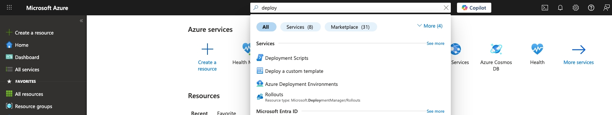
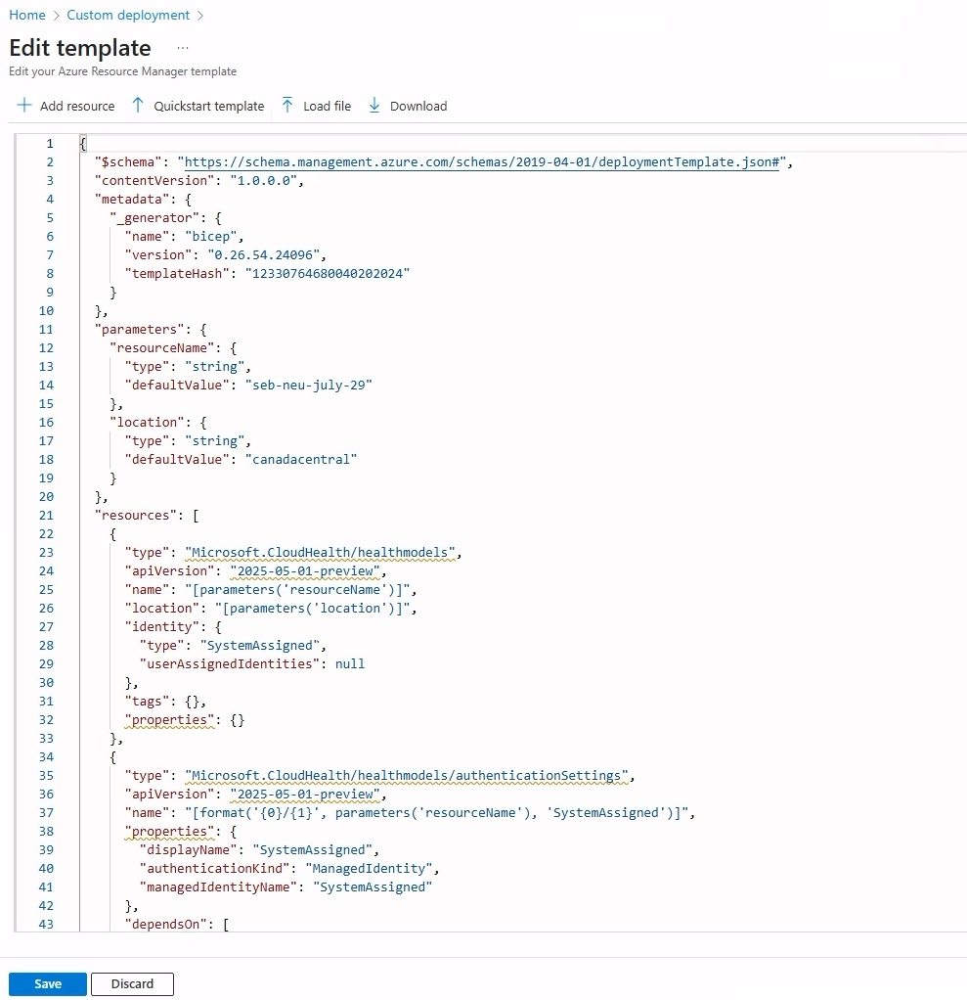

# Azure Monitor health models migration utility

This is a simple tool to convert a Azure Monitor health models **Private Preview** configuration to an Azure Monitor health models **Public Preview** configuration. It outputs either a Bicep or ARM template file to deploy a new Public Preview health model resource with all related resource types.

## Prerequisites

- .NET 8 runtime installed
- Utility tool binaries downloaded from the **Releases** section of this GitHub repository.

## Remarks

- The public preview is not available in all the same Azure locations as the private preview version. The migration tool will thus default to another location if your former location is currently not yet supported.
- There are minor scenarios which cannot be migrated 1:1. Watch out in the tool's log output for any warnings.

## Usage

The migration utility has two modes:

- File input
- Load private preview configuration directly from Azure

### File input

This method allows to convert a model configuration after it has been manually exported from Azure and stored in a file. The tool will not require any connection/permission to Azure.

- Fetch the health model configuration from the Azure portal:


- Copy the entire JSON definition and store it in a local file, e.g. under **/tmp/v1_input.json**


```bash
Microsoft.CloudHealth.PreviewMigration.exe convert file --inputfile /tmp/v1_input.json --outputfolder /tmp
```

### Load private preview configuration from Azure

This method will attempt to fetch the health model directly from Azure, using only a resourceId as input. It requires your current user being logged in using Azure CLI etc.

- Get the resource id of the health model resource

```bash
Microsoft.CloudHealth.PreviewMigration.exe convert azure --resourceId /subscriptions/7ddfffd7-abcd-40df-b352-828cbd55d6f4/resourceGroups/demo-rg/providers/Microsoft.HealthModel/healthmodels/my-model --outputfolder /tmp --armtemplate
```

You can see the optional switch `--armtemplate` which will output a compiled ARM template instead of a Bicep file.

### Deploy new resource to Azure

After you executed the commands above, in your specified output folder you will find a Bicep or ARM template file. You can use that to directly deploy a new health model resource to Azure:

#### Deploy via CLI

If you have the Azure CLI installed, you can start the deployment like this

```bash
az account set --subscription <target subscription id>
az deployment group create --resource-group <your target resource group> --template-file <generated-arm-template|bicep file>
```

You can overwrite the default parameters for resource name and location using the `--parameters` argument.

#### Deploy via Azure Portal

> This requires that you have run the migration tool with the `--armtemplate` switch. Or you manually run `az bicep build --file <generated bicep file>`

1) In the search box on top of the Portal type **deploy a custom template** 
1) Click on **Build your own template in the editor**
1) Click on **Load file** and select your generated ARM template JSON file. 
1) Click on Save.
1) Validate the parameters, click on **Review + Create** and start the deployment.

## Trademarks

This project may contain trademarks or logos for projects, products, or services. Authorized use of Microsoft
trademarks or logos is subject to and must follow
[Microsoft's Trademark & Brand Guidelines](https://www.microsoft.com/legal/intellectualproperty/trademarks/usage/general).
Use of Microsoft trademarks or logos in modified versions of this project must not cause confusion or imply Microsoft sponsorship.
Any use of third-party trademarks or logos are subject to those third-party's policies.
