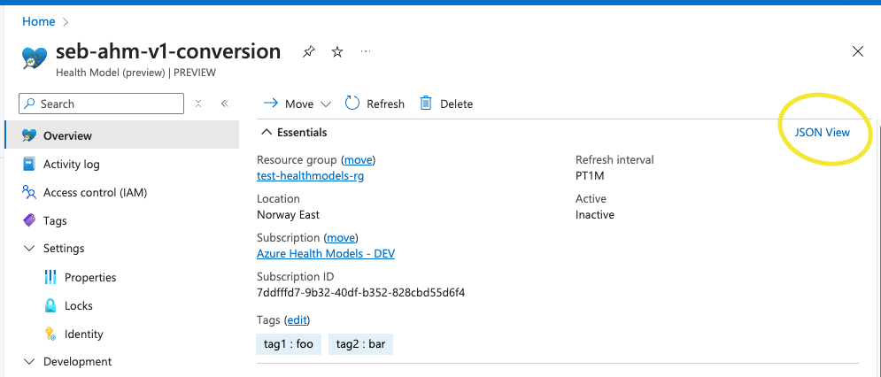
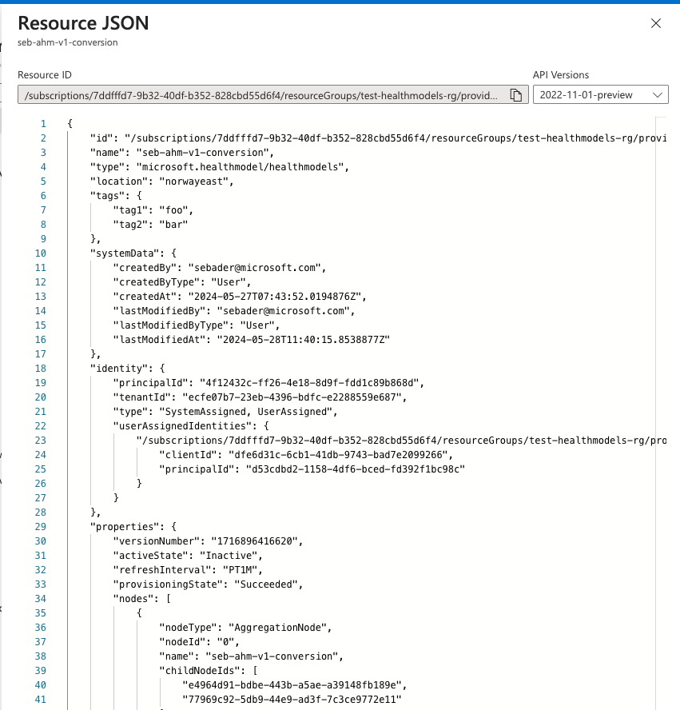

# Azure MonitorH ealth Models migration utility

This is a simple tool to convert a Azure Health Models **Private Preview** configuration to an Azure Monitor Health Models **Public Preview** configuration. It outputs either a Bicep or ARM template file to deploy a new Public Preview health model resource with all related resource types.

## Usage

There are two modes:

- File input
- Load private preview configuration directly from Azure

## Prerequisites

- .NET 8 runtime installed

### File input

This method allows to convert a model configuration after it has been manually exported from Azure and stored in a file. The tool will not require any connection/permission to Azure.

- Fetch the health model configuration from the Azure portal:


- Copy the entire JSON definition and store it in a local file, e.g. under **/tmp/v1_input.json**


```bash
dotnet Microsoft.CloudHealth.PreviewMigration.dll convert file --inputfile /tmp/v1_input.json --outputfolder /tmp
```

### Load private preview configuration from Azure

This method will attempt to fetch the health model directly from Azure, using only a resourceId as input. It requires your current user being logged in using Azure CLI etc.

- Get the resource id of the health model resource
- Run `az login` on your command prompt before executing the command below

```bash
dotnet Microsoft.CloudHealth.PreviewMigration.dll convert azure --resourceId /subscriptions/7ddfffd7-abcd-40df-b352-828cbd55d6f4/resourceGroups/demo-rg/providers/Microsoft.HealthModel/healthmodels/my-model --outputfolder /tmp --armtemplate
```

You can see the optional switch `--armtemplate` which will output a compiled ARM template instead of a Bicep file.

## Contributing

This project welcomes contributions and suggestions.  Most contributions require you to agree to a
Contributor License Agreement (CLA) declaring that you have the right to, and actually do, grant us
the rights to use your contribution. For details, visit [Contributor License Agreements](https://cla.opensource.microsoft.com).

When you submit a pull request, a CLA bot will automatically determine whether you need to provide
a CLA and decorate the PR appropriately (e.g., status check, comment). Simply follow the instructions
provided by the bot. You will only need to do this once across all repos using our CLA.

This project has adopted the [Microsoft Open Source Code of Conduct](https://opensource.microsoft.com/codeofconduct/).
For more information see the [Code of Conduct FAQ](https://opensource.microsoft.com/codeofconduct/faq/) or
contact [opencode@microsoft.com](mailto:opencode@microsoft.com) with any additional questions or comments.

## Trademarks

This project may contain trademarks or logos for projects, products, or services. Authorized use of Microsoft
trademarks or logos is subject to and must follow
[Microsoft's Trademark & Brand Guidelines](https://www.microsoft.com/legal/intellectualproperty/trademarks/usage/general).
Use of Microsoft trademarks or logos in modified versions of this project must not cause confusion or imply Microsoft sponsorship.
Any use of third-party trademarks or logos are subject to those third-party's policies.
